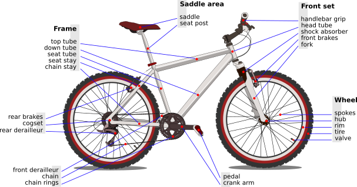
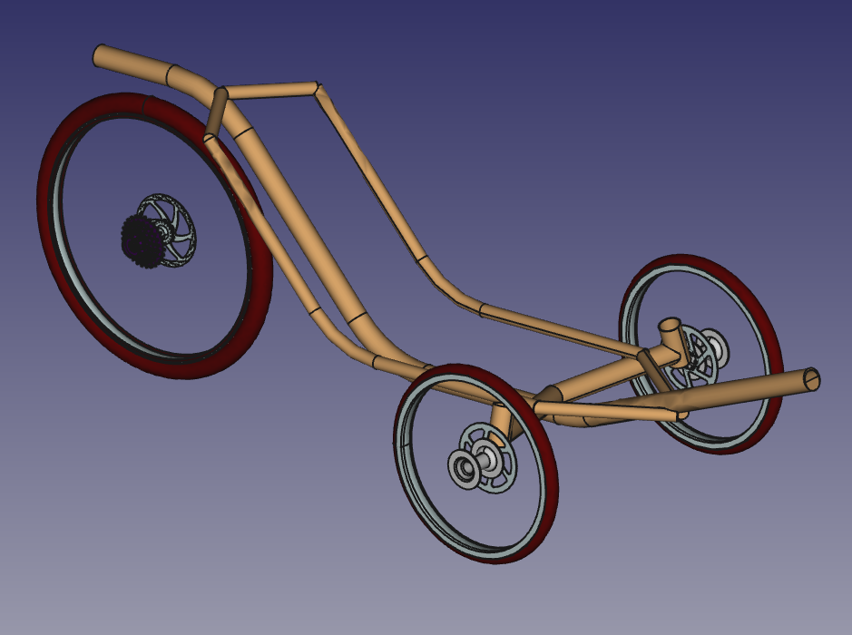

# Bike3D
FreeCAD Bike or Trike 3D elements.

I have not found a collection of pieces to be used with FreeCAD, so I started mine.

 (*Bicycle parts By Al2 - Own work, CC BY 3.0, https://commons.wikimedia.org/w/index.php?curid=2995998*)

This library is far from being complete. It is far from being acurate : I have not the dimentions of the pieces and some are fantasists. When I find some information on the net, or when I can mesure something, I improve the piece. Like Wikipedia, OpenStreetMap and other project, it would be more and more acurate. With your help...

This collection will grow slowly according to my needs and my lack of skill in CAD. And according to your contributions. Fork me !

My project is making a bamboo trike with hemp joins and recycled aluminium. Hence the name : **Biotrike**.

The content of this repository is under GNU licence or CC-BY-SA.
