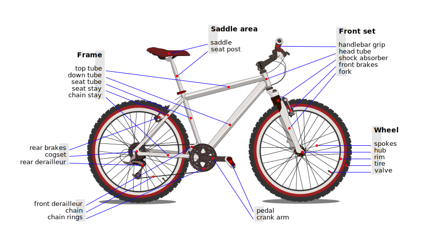

# Bike3D
FreeCAD Bike or Trike 3D elements.

I have not found a collection of pieces to be used with FreeCAD, so I started mine.

 (*Bicycle parts By Al2 - Own work, CC BY 3.0, https://commons.wikimedia.org/w/index.php?curid=2995998*)

This library is far from being complete. It will grow slowly according to my needs and my lack of skill in CAD.

My project is making a bamboo trike with hemp joins and recycled aluminium. Hence the name : **Biotrike**.

The content of this repository is under GNU licence or CC-BY-SA.
